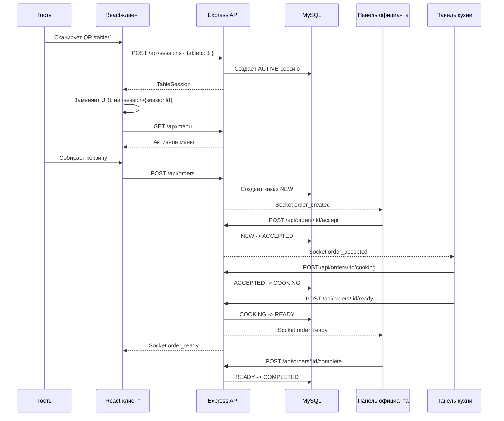
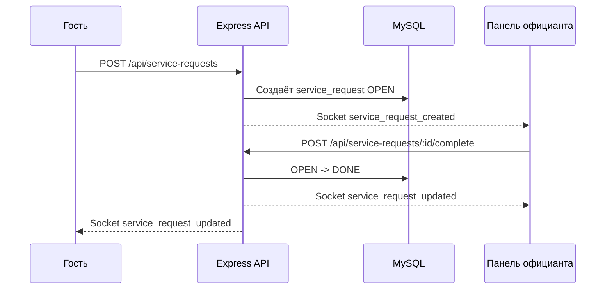
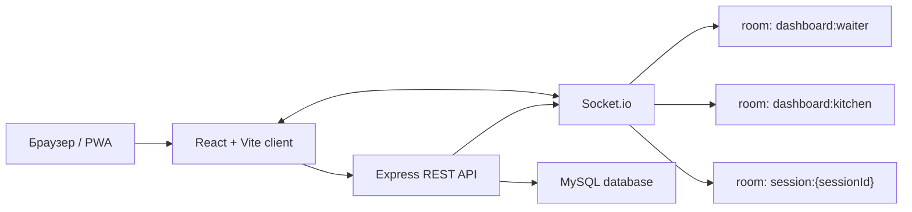
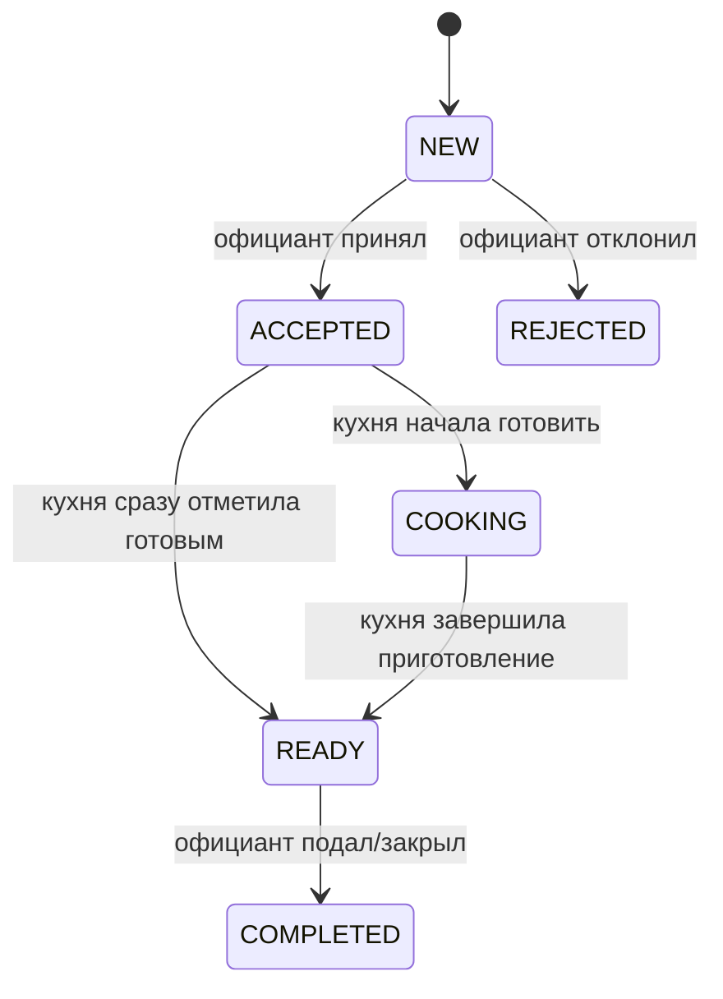

# QR-заказы в ресторане

Полноценный full-stack MVP для ресторана, где гость открывает меню по QR-коду на столе, собирает корзину, отправляет заказ, вызывает официанта, а сотрудники видят новые события в реальном времени. Система закрывает основной цикл обслуживания зала: QR-меню, заказы, статусы кухни, сервисные запросы, стоп-лист, QR-коды столов и сводка владельца.

Проект рассчитан на локальный запуск, демонстрацию и дальнейшее развитие в сторону production-системы с авторизацией, ролями, оплатой, фискализацией и полноценным администрированием.

## Содержание

- [Что это за система](#что-это-за-система)
- [Основные возможности](#основные-возможности)
- [Роли пользователей](#роли-пользователей)
- [Сценарии работы](#сценарии-работы)
- [Архитектура](#архитектура)
- [Стек технологий](#стек-технологий)
- [Структура проекта](#структура-проекта)
- [Быстрый запуск](#быстрый-запуск)
- [Подробная настройка](#подробная-настройка)
- [Страницы приложения](#страницы-приложения)
- [База данных](#база-данных)
- [Статусы и бизнес-логика](#статусы-и-бизнес-логика)
- [HTTP API](#http-api)
- [Socket.io realtime](#socketio-realtime)
- [PWA и клиентское поведение](#pwa-и-клиентское-поведение)
- [Тестирование и сборка](#тестирование-и-сборка)
- [Типичные проблемы](#типичные-проблемы)
- [Ограничения MVP](#ограничения-mvp)
- [Что добавить для production](#что-добавить-для-production)

## Что это за система

Система предназначена для ресторанов, кафе, баров и фуд-кортов, где гостю удобнее заказать без ожидания официанта:

1. На каждом столе размещается QR-код.
2. Гость сканирует QR и попадает на страницу конкретного стола.
3. Приложение создаёт активную сессию посадки.
4. Гость выбирает блюда, модификаторы и комментарии.
5. Заказ уходит официанту.
6. Официант принимает или отклоняет заказ.
7. Принятый заказ появляется на кухне.
8. Кухня переводит заказ в приготовление и затем в готовность.
9. Официант видит готовый заказ и завершает его после подачи.
10. Владелец видит дневную сводку по выручке, заказам, активным столам и популярным позициям.

Это не просто статичное меню. В проекте уже есть сервер, база данных, realtime-события, рабочие панели для разных ролей и административная часть.

## Основные возможности

- QR-ссылка привязана к конкретному столу как точка входа: например, `/table/1`.
- После открытия QR или ручного ввода номера стола адрес автоматически заменяется на случайную ссылку сессии вида `/session/2f2be9dd-9484-42dc-83db-180e34d6fd4a`.
- Каждый новый заход через `/table/:tableId` создаёт новую активную сессию и новый случайный URL.
- Клиент может открыть меню по QR или вручную ввести код стола на стартовом экране.
- Каждое открытие меню стола создаёт отдельную сессию посадки.
- В рамках одной сессии можно сделать несколько заказов.
- Заказ защищён от дублей через клиентский `orderId`.
- Меню поддерживает активные и неактивные позиции.
- Неактивные позиции скрываются от гостей, но видны в админке.
- Блюда поддерживают модификаторы: прожарка, соус, добавки, лёд и так далее.
- Модификаторы могут менять цену позиции.
- В корзине есть количество, комментарий к конкретному блюду и общий комментарий к заказу.
- Итог заказа считает сумму блюд, модификаторов, сервисный сбор и итог с обслуживанием.
- Гость может отправить сервисный запрос: официант, вода, счёт, уборка.
- Официант получает новые заказы и сервисные запросы в реальном времени.
- Официант принимает, отклоняет и завершает заказы.
- Кухня получает только принятые заказы.
- Кухня переводит заказ в `COOKING` и `READY`.
- Гость видит свои заказы и получает realtime-обновления статуса.
- Админка позволяет менять название ресторана, цвет бренда и процент обслуживания.
- Админка позволяет добавлять позиции меню, менять цену, описание, картинку и активность.
- Админка генерирует QR-коды для всех столов.
- QR-коды можно скачать как PNG.
- Экран владельца показывает основные метрики за текущий день.
- Клиентская часть работает как PWA: есть manifest, service worker и офлайн-кэш для shell/assets.

## Роли пользователей

### Гость

Гость открывает `/table/:tableId`, видит меню, выбирает позиции, добавляет модификаторы и оформляет заказ. Гость не видит панели сотрудников и не управляет статусами. Для гостя важны быстрый выбор, понятная корзина, комментарии и кнопки сервисных запросов.

Основные действия гостя:

- открыть меню стола;
- искать блюдо;
- переключаться по категориям;
- выбрать модификаторы;
- добавить блюдо в корзину;
- изменить количество;
- оставить комментарий к блюду;
- оставить комментарий ко всему заказу;
- отправить заказ;
- посмотреть историю заказов текущей сессии;
- вызвать официанта, воду, счёт или уборку.

### Официант

Официант работает на странице `/waiter`. Он видит очередь заказов, сервисные запросы и готовые блюда. Панель официанта получает новые события через Socket.io.

Основные действия официанта:

- увидеть новый заказ;
- принять заказ;
- отклонить заказ;
- увидеть заказ в работе;
- увидеть, что кухня отметила заказ готовым;
- завершить заказ после подачи;
- увидеть сервисный запрос гостя;
- закрыть сервисный запрос кнопкой "Готово".

### Кухня

Кухня работает на странице `/kitchen`. На кухню попадают только заказы, которые официант уже принял. Это важно: гость не отправляет заказ напрямую на приготовление, официант остаётся точкой контроля.

Основные действия кухни:

- увидеть принятый заказ;
- перевести заказ в `COOKING`;
- перевести заказ в `READY`;
- видеть таймеры и состав заказа;
- получать новые принятые заказы без перезагрузки страницы.

### Администратор

Администратор работает на странице `/admin`. Эта страница нужна для настройки меню, QR-кодов и базового брендинга ресторана.

Основные действия администратора:

- изменить название ресторана;
- изменить акцентный цвет;
- изменить процент обслуживания;
- посмотреть список столов;
- открыть ссылку конкретного стола;
- скачать QR-код конкретного стола;
- добавить новую позицию меню;
- изменить название, описание, цену и картинку позиции;
- включить или выключить позицию меню.

Важно: текущая админка показывает модификаторы, но не содержит отдельного редактора модификаторов. Модификаторы сейчас добавляются и изменяются через SQL или будущий отдельный интерфейс.

### Владелец

Владелец работает на странице `/owner`. Это обзорная панель за текущий день.

Панель показывает:

- выручку за сегодня;
- количество заказов за сегодня;
- средний чек;
- количество активных столов;
- количество открытых сервисных запросов;
- топ популярных блюд;
- быстрые ссылки в админку, официантскую и кухонную панели.

## Сценарии работы

### Основной сценарий заказа



### Сценарий сервисного запроса



### Сценарий изменения меню

1. Администратор меняет позицию меню или добавляет новую.
2. API сохраняет изменение в `menu_items`.
3. Сервер отправляет Socket.io событие `menu_updated`.
4. Клиентские экраны перезагружают меню и настройки.
5. Гость видит актуальные позиции без ручной перезагрузки.

### Сценарий изменения брендинга

1. Администратор меняет название ресторана, цвет или процент обслуживания.
2. API сохраняет запись в `restaurant_settings`.
3. Сервер отправляет событие `settings_updated`.
4. Гость получает обновлённые настройки.
5. QR-коды в админке перегенерируются с новым акцентным цветом.

## Архитектура

Проект состоит из трёх основных частей:

- `client` — React/Vite приложение для гостей и сотрудников.
- `server` — Express API и Socket.io realtime-сервер.
- `database` — SQL-схема и демо-данные для MySQL.



Клиент обращается к API по HTTP для обычных операций: загрузить меню, создать заказ, сменить статус. Для live-обновлений используется Socket.io: новые заказы, готовность блюда, сервисные запросы и обновление меню.

## Стек технологий

### Frontend

- React 18
- TypeScript
- Vite
- Framer Motion
- Lucide React
- Socket.io Client
- QRCode generator
- PWA manifest
- Service Worker

### Backend

- Node.js
- Express
- TypeScript
- Socket.io
- MySQL2
- Zod
- Morgan
- dotenv

### Database

- MySQL
- InnoDB
- `utf8mb4`
- SQL-схема с внешними ключами, индексами и ограничениями.

## Структура проекта

```text
.
├── client/
│   ├── public/
│   │   ├── icons/
│   │   ├── menu/
│   │   ├── manifest.webmanifest
│   │   └── sw.js
│   ├── src/
│   │   ├── components/
│   │   ├── hooks/
│   │   ├── styles/
│   │   ├── AdminDashboard.tsx
│   │   ├── App.tsx
│   │   ├── CustomerApp.tsx
│   │   ├── KitchenDashboard.tsx
│   │   ├── OwnerDashboard.tsx
│   │   ├── WaiterDashboard.tsx
│   │   ├── api.ts
│   │   ├── socket.ts
│   │   └── types.ts
│   ├── index.html
│   ├── package.json
│   ├── tsconfig.json
│   └── vite.config.ts
├── server/
│   ├── src/
│   │   ├── app.ts
│   │   ├── config.ts
│   │   ├── db.ts
│   │   ├── errors.ts
│   │   ├── realtime.ts
│   │   ├── repository.ts
│   │   ├── server.ts
│   │   └── types.ts
│   ├── package.json
│   └── tsconfig.json
├── database/
│   ├── schema.sql
│   └── seed.sql
├── package.json
└── README.md
```

### Важные frontend-файлы

- `client/src/App.tsx` — выбирает страницу по URL: гость, официант, кухня, админка или владелец.
- `client/src/CustomerApp.tsx` — клиентское QR-меню, корзина, заказ, сервисные запросы.
- `client/src/WaiterDashboard.tsx` — рабочее место официанта.
- `client/src/KitchenDashboard.tsx` — рабочее место кухни.
- `client/src/AdminDashboard.tsx` — меню, QR-коды и настройки ресторана.
- `client/src/OwnerDashboard.tsx` — сводка владельца.
- `client/src/api.ts` — REST-клиент и нормализация данных.
- `client/src/socket.ts` — Socket.io клиент.
- `client/src/utils/text.ts` — исправление mojibake для строк, которые пришли в неправильной кодировке.
- `client/src/styles/main.css` — основные стили приложения.

### Важные backend-файлы

- `server/src/server.ts` — создаёт HTTP-сервер, подключает Express и Socket.io.
- `server/src/app.ts` — объявляет REST API, валидацию и обработчики ошибок.
- `server/src/repository.ts` — вся работа с MySQL и бизнес-правила.
- `server/src/realtime.ts` — комнаты Socket.io и публикация событий.
- `server/src/config.ts` — переменные окружения и значения по умолчанию.
- `server/src/db.ts` — пул подключений MySQL.
- `server/src/types.ts` — DTO и доменные типы.

## Быстрый запуск

### Требования

- Node.js
- npm
- MySQL Server

### Команды

```bash
npm install
mysql -u root -p < database/schema.sql
mysql -u root -p qr_restaurant < database/seed.sql
npm run dev
```

После запуска будут доступны:

- клиент: `http://localhost:5173`
- API: `http://localhost:4000`
- healthcheck: `http://localhost:4000/health`

Если MySQL работает с пользователем `root` без пароля и базой `qr_restaurant`, дополнительные настройки не нужны. Если пароль, хост или имя базы отличаются, настройте переменные окружения.

## Подробная настройка

### Установка зависимостей

В корне проекта:

```bash
npm install
```

Проект использует npm workspaces:

- `client`
- `server`

Корневые команды запускают команды внутри этих workspace.

### Создание базы данных

```bash
mysql -u root -p < database/schema.sql
```

Этот скрипт:

- создаёт базу `qr_restaurant`, если её нет;
- выставляет `utf8mb4`;
- создаёт таблицы;
- создаёт индексы;
- создаёт внешние ключи;
- добавляет ограничения для некоторых полей.

### Загрузка демо-данных

```bash
mysql -u root -p qr_restaurant < database/seed.sql
```

Демо-данные включают:

- 6 столов;
- настройки ресторана `Demo Bistro`;
- 6 позиций меню;
- изображения блюд из `client/public/menu`;
- модификаторы для блюд.

Скрипт можно запускать повторно: для основных демо-записей используется `ON DUPLICATE KEY UPDATE`.

### Запуск разработки

```bash
npm run dev
```

Команда запускает одновременно:

- backend: `npm run dev -w server`
- frontend: `npm run dev -w client`

Backend стартует на `http://localhost:4000`.
Frontend стартует на `http://localhost:5173`.

### Переменные окружения backend

Backend читает переменные через `dotenv`. При запуске workspace-скриптов удобнее создать файл `server/.env`.

Пример:

```env
PORT=4000
CLIENT_URL=http://localhost:5173

DB_HOST=localhost
DB_PORT=3306
DB_USER=root
DB_PASSWORD=
DB_NAME=qr_restaurant
DB_CONNECTION_LIMIT=10

SESSION_TIMEOUT_MINUTES=90
```

Описание:

| Переменная | По умолчанию | Назначение |
| --- | --- | --- |
| `PORT` | `4000` | Порт Express и Socket.io сервера. |
| `CLIENT_URL` | `http://localhost:5173` | Разрешённый origin для CORS. |
| `DB_HOST` | `localhost` | Хост MySQL. |
| `DB_PORT` | `3306` | Порт MySQL. |
| `DB_USER` | `root` | Пользователь MySQL. |
| `DB_PASSWORD` | пусто | Пароль MySQL. |
| `DB_NAME` | `qr_restaurant` | Имя базы данных. |
| `DB_CONNECTION_LIMIT` | `10` | Размер пула подключений. |
| `SESSION_TIMEOUT_MINUTES` | `90` | Время жизни активной сессии без активности. Значение ограничено диапазоном 60-120 минут. |

### Переменные окружения frontend

Frontend читает только переменные с префиксом `VITE_`. Их удобно хранить в `client/.env`.

Пример:

```env
VITE_API_URL=http://localhost:4000
VITE_SOCKET_URL=http://localhost:4000
```

Описание:

| Переменная | По умолчанию | Назначение |
| --- | --- | --- |
| `VITE_API_URL` | `http://localhost:4000` | URL backend API. |
| `VITE_SOCKET_URL` | значение `VITE_API_URL` или `http://localhost:4000` | URL Socket.io сервера. |

## Страницы приложения

### Стартовая страница гостя

URL:

```text
http://localhost:5173/
```

Если гость открывает корень сайта без QR-кода, он видит форму ввода кода стола. Можно ввести `1`, `2`, `3` и так далее. После отправки приложение использует `/table/:tableId` как техническую входную ссылку, создаёт сессию и сразу заменяет адрес на случайный `/session/:sessionId`.

### Вход в меню конкретного стола

URL:

```text
http://localhost:5173/table/1
```

Логика:

- `1` берётся из URL;
- клиент отправляет `POST /api/sessions`;
- сервер создаёт сессию для стола;
- клиент сразу заменяет адрес в браузере на `/session/:sessionId`;
- клиент загружает настройки и меню;
- гость видит QR-меню.

Итоговый адрес в браузере будет случайным, например:

```text
http://localhost:5173/session/2f2be9dd-9484-42dc-83db-180e34d6fd4a
```

Этот адрес можно обновлять: frontend загрузит существующую сессию через `GET /api/sessions/:sessionId`.

Также поддерживается query-параметр:

```text
http://localhost:5173/?table_token=1
```

Фактически `table_token` сейчас используется как ID стола. Сервер ожидает положительное число, а после создания сессии всё равно переводит гостя на случайный `/session/:sessionId`.

### Панель официанта

URL:

```text
http://localhost:5173/waiter
```

Показывает:

- новые заказы `NEW`;
- активные заказы `ACCEPTED` и `COOKING`;
- готовые заказы `READY`;
- открытые сервисные запросы `OPEN`;
- метрики по текущей очереди.

### Панель кухни

URL:

```text
http://localhost:5173/kitchen
```

Показывает:

- заказы `ACCEPTED`, ожидающие старта;
- заказы `COOKING`, которые готовятся;
- действия для перевода заказа в `COOKING` и `READY`.

### Админка

URL:

```text
http://localhost:5173/admin
```

Показывает:

- настройки бренда;
- QR-коды столов;
- список меню;
- форму добавления позиции;
- стоп-лист через включение/выключение позиции.

QR-коды генерируются на клиенте библиотекой `qrcode` и ведут на:

```text
{baseUrl}/table/{table.id}
```

Это публичная входная ссылка стола. Когда гость её открывает, приложение создаёт новую сессию и заменяет адрес на случайный `/session/:sessionId`, поэтому в адресной строке гость не остаётся на `/table/1`.

Например:

```text
http://localhost:5173/table/1
```

### Панель владельца

URL:

```text
http://localhost:5173/owner
```

Показывает агрегаты из `GET /api/owner/summary`.

Дневные метрики считаются по условию:

```sql
created_at >= CURDATE()
```

Отклонённые заказы `REJECTED` в выручку и количество заказов не входят.

## База данных

Схема находится в `database/schema.sql`.

### Таблица `tables`

Хранит столы ресторана.

Поля:

- `id` — внутренний ID стола.
- `number` — отображаемый номер стола, уникальный.

Используется:

- для генерации QR-кодов;
- для создания сессий;
- для отображения номера стола в заказах и запросах.

### Таблица `restaurant_settings`

Хранит настройки ресторана. В системе предполагается одна запись с `id = 1`.

Поля:

- `name` — название ресторана.
- `accent_color` — основной цвет интерфейса.
- `cover_image` — поле под изображение обложки.
- `service_rate` — процент обслуживания в виде доли, например `0.1000` для 10%.

Ограничение:

- `service_rate` должен быть от `0` до `0.25`.

### Таблица `sessions`

Хранит сессии посадок.

Поля:

- `id` — UUID сессии.
- `table_id` — стол.
- `status` — `ACTIVE`, `EXPIRED` или `CLOSED`.
- `created_at` — время создания.
- `last_activity` — последняя активность.

Сессия создаётся при открытии QR-меню стола. Заказы и сервисные запросы привязаны к сессии.

### Таблица `session_events`

Журнал событий сессии.

Сейчас туда пишутся:

- `SESSION_CREATED`;
- `SERVICE_REQUEST_CREATED`.

Эта таблица полезна для аудита и будущей аналитики.

### Таблица `menu_items`

Хранит позиции меню.

Поля:

- `id` — ID позиции.
- `name` — название.
- `price` — цена.
- `description` — описание.
- `image` — путь или URL картинки.
- `active` — доступность позиции для гостя.

Гостевое меню показывает только `active = TRUE`.
Админка показывает и активные, и неактивные позиции.

### Таблица `menu_item_modifiers`

Хранит модификаторы блюд.

Поля:

- `id` — ID модификатора.
- `menu_item_id` — блюдо, к которому относится модификатор.
- `name` — название.
- `price_delta` — изменение цены.
- `active` — доступность.
- `sort_order` — порядок отображения.

Примеры:

- прожарка medium rare;
- well done;
- дополнительный соус;
- без лимона;
- меньше льда.

### Таблица `orders`

Хранит заказы.

Поля:

- `id` — UUID заказа, создаётся на клиенте для идемпотентности.
- `table_id` — стол.
- `session_id` — сессия.
- `status` — текущий статус.
- `note` — общий комментарий.
- `created_at` — время создания.
- `updated_at` — время обновления.

Статусы:

- `NEW`
- `ACCEPTED`
- `COOKING`
- `READY`
- `COMPLETED`
- `REJECTED`

### Таблица `order_items`

Хранит строки заказа.

Поля:

- `id` — ID строки.
- `order_id` — заказ.
- `menu_item_id` — блюдо.
- `qty` — количество.
- `note` — комментарий к конкретному блюду.

### Таблица `order_item_modifiers`

Хранит выбранные модификаторы в заказе.

Важно: при создании заказа система копирует `name` и `price_delta` модификатора в заказ. Поэтому если позже изменить модификатор в меню, старые заказы сохранят исторически правильные названия и цены.

Поля:

- `id` — ID записи.
- `order_item_id` — строка заказа.
- `modifier_id` — ссылка на исходный модификатор, может стать `NULL`.
- `name` — сохранённое название.
- `price_delta` — сохранённая добавка к цене.

### Таблица `order_events`

Журнал смены статусов заказа.

Поля:

- `order_id`;
- `event_type`;
- `from_status`;
- `to_status`;
- `payload`;
- `created_at`.

Используется для аудита жизненного цикла заказа.

### Таблица `service_requests`

Хранит запросы гостя к официанту.

Поля:

- `id` — UUID запроса.
- `table_id` — стол.
- `session_id` — сессия.
- `type` — тип запроса.
- `status` — `OPEN` или `DONE`.
- `note` — комментарий.
- `created_at`;
- `updated_at`.

Типы запросов:

- `WAITER` — позвать официанта.
- `WATER` — принести воду.
- `BILL` — принести счёт.
- `CLEANUP` — убрать стол.

## Статусы и бизнес-логика

### Статусы заказа



### Правила переходов

| Действие | Endpoint | Разрешено из | Новый статус |
| --- | --- | --- | --- |
| Принять | `POST /api/orders/:id/accept` | `NEW` | `ACCEPTED` |
| Отклонить | `POST /api/orders/:id/reject` | `NEW` | `REJECTED` |
| Начать готовить | `POST /api/orders/:id/cooking` | `ACCEPTED` | `COOKING` |
| Готово | `POST /api/orders/:id/ready` | `ACCEPTED`, `COOKING` | `READY` |
| Завершить | `POST /api/orders/:id/complete` | `READY` | `COMPLETED` |

Если попытаться сделать запрещённый переход, сервер вернёт `409`.

### Идемпотентность заказа

Клиент отправляет `orderId`, созданный через `crypto.randomUUID()`.

Если заказ с таким `id` уже существует:

- сервер не создаёт дубль;
- возвращает существующий заказ;
- в `meta` приходит `idempotent: true`.

Это защищает от повторной отправки при проблемах сети или двойном клике.

### Проверка сессии

При создании заказа сервер проверяет:

- сессия существует;
- сессия активна;
- сессия относится к тому же столу;
- все позиции меню активны;
- все модификаторы активны;
- каждый модификатор относится к выбранному блюду.

### Истечение сессий

Сервер периодически вызывает `expireInactiveSessions()` перед важными операциями. Активная сессия становится `EXPIRED`, если `last_activity` старше `SESSION_TIMEOUT_MINUTES`.

По умолчанию это 90 минут.

## HTTP API

Все ответы успешных запросов имеют общий формат:

```json
{
  "data": {}
}
```

Некоторые ответы могут включать `meta`:

```json
{
  "data": {},
  "meta": {
    "idempotent": true
  }
}
```

Ошибки имеют формат:

```json
{
  "error": {
    "message": "Описание ошибки",
    "details": {}
  }
}
```

### Healthcheck

```http
GET /health
```

Проверяет доступность API и соединение с базой.

Успешный ответ:

```json
{
  "ok": true
}
```

### Настройки ресторана

```http
GET /api/settings
```

Возвращает:

```json
{
  "data": {
    "name": "Demo Bistro",
    "accentColor": "#2f6f5e",
    "coverImage": null,
    "serviceRate": 0.1
  }
}
```

```http
PUT /api/admin/settings
```

Тело:

```json
{
  "name": "Demo Bistro",
  "accentColor": "#2f6f5e",
  "coverImage": null,
  "serviceRate": 0.1
}
```

Ограничения:

- `name` от 2 до 80 символов;
- `accentColor` в формате `#RRGGBB`;
- `coverImage` до 500 символов или `null`;
- `serviceRate` от 0 до 0.25.

### Столы

```http
GET /api/tables
```

Возвращает список столов:

```json
{
  "data": [
    { "id": 1, "number": "1" },
    { "id": 2, "number": "2" }
  ]
}
```

### Меню гостя

```http
GET /api/menu
```

Возвращает только активные позиции и активные модификаторы.

Пример:

```json
{
  "data": [
    {
      "id": 1,
      "name": "Стейк-боул на гриле",
      "price": 18.5,
      "description": "Описание блюда",
      "image": "/menu/steak-bowl.jpg",
      "active": true,
      "modifiers": [
        {
          "id": 1,
          "menuItemId": 1,
          "name": "Прожарка medium rare",
          "priceDelta": 0,
          "active": true
        }
      ]
    }
  ]
}
```

### Меню админки

```http
GET /api/admin/menu
```

Возвращает активные и неактивные позиции.

```http
POST /api/admin/menu
```

Создаёт позицию меню.

Тело:

```json
{
  "name": "Паста с томатами",
  "price": 12.5,
  "description": "Домашняя паста, томаты, базилик",
  "image": "/menu/pasta.jpg",
  "active": true
}
```

Ограничения:

- `name` от 2 до 120 символов;
- `price` больше 0 и до 1 000 000;
- `description` до 1000 символов;
- `image` до 500 символов;
- `active` опционально.

```http
PATCH /api/admin/menu/:menuItemId
```

Обновляет позицию меню.

Тело частичное:

```json
{
  "price": 13,
  "active": false
}
```

### Сессии столов

```http
POST /api/sessions
```

Создаёт активную сессию стола.

Тело:

```json
{
  "tableId": 1
}
```

Ответ:

```json
{
  "data": {
    "id": "uuid",
    "tableId": 1,
    "tableNumber": "1",
    "status": "ACTIVE",
    "createdAt": "2026-05-13T00:00:00.000Z",
    "lastActivity": "2026-05-13T00:00:00.000Z"
  }
}
```

```http
GET /api/sessions/:sessionId
```

Возвращает уже созданную сессию по случайному UUID. Используется, когда гость обновляет страницу на `/session/:sessionId`.

Ответ:

```json
{
  "data": {
    "id": "2f2be9dd-9484-42dc-83db-180e34d6fd4a",
    "tableId": 1,
    "tableNumber": "1",
    "status": "ACTIVE",
    "createdAt": "2026-05-13T00:00:00.000Z",
    "lastActivity": "2026-05-13T00:00:00.000Z"
  }
}
```

### Заказы сессии

```http
GET /api/sessions/:sessionId/orders
```

Возвращает заказы конкретной сессии, новые сверху.

### Создание заказа

```http
POST /api/orders
```

Тело:

```json
{
  "orderId": "c8c52c94-7dc5-49a1-9294-87e5dd44372a",
  "tableId": 1,
  "sessionId": "2f2be9dd-9484-42dc-83db-180e34d6fd4a",
  "note": "Без спешки, пожалуйста",
  "items": [
    {
      "menuItemId": 1,
      "qty": 2,
      "note": "Без лука",
      "modifierIds": [1, 3]
    }
  ]
}
```

Ограничения:

- `orderId` должен быть UUID;
- `tableId` положительное число;
- `sessionId` UUID;
- `note` до 500 символов;
- `items` от 1 до 50 строк;
- `qty` от 1 до 20;
- комментарий к блюду до 300 символов;
- максимум 10 модификаторов на строку.

Ответ содержит заказ с рассчитанными суммами:

```json
{
  "data": {
    "id": "c8c52c94-7dc5-49a1-9294-87e5dd44372a",
    "tableId": 1,
    "tableNumber": "1",
    "sessionId": "2f2be9dd-9484-42dc-83db-180e34d6fd4a",
    "status": "NEW",
    "note": "Без спешки, пожалуйста",
    "items": [],
    "total": 37,
    "serviceFee": 3.7,
    "totalWithService": 40.7
  }
}
```

### Получение заказа

```http
GET /api/orders/:orderId
```

Возвращает заказ по UUID.

### Очередь официанта

```http
GET /api/waiter/orders
```

Возвращает заказы со статусами:

- `NEW`
- `ACCEPTED`
- `COOKING`
- `READY`

```http
GET /api/waiter/service-requests
```

Возвращает открытые сервисные запросы.

### Очередь кухни

```http
GET /api/kitchen/orders
```

Возвращает заказы со статусами:

- `ACCEPTED`
- `COOKING`

### Сервисные запросы

```http
POST /api/service-requests
```

Тело:

```json
{
  "tableId": 1,
  "sessionId": "2f2be9dd-9484-42dc-83db-180e34d6fd4a",
  "type": "WAITER",
  "note": "Нужна помощь"
}
```

Типы:

- `WAITER`
- `WATER`
- `BILL`
- `CLEANUP`

```http
POST /api/service-requests/:requestId/complete
```

Закрывает открытый запрос.

### Сводка владельца

```http
GET /api/owner/summary
```

Ответ:

```json
{
  "data": {
    "ordersToday": 8,
    "revenueToday": 120000,
    "averageCheck": 15000,
    "activeTables": 3,
    "openServiceRequests": 1,
    "popularItems": [
      {
        "menuItemId": 1,
        "name": "Стейк-боул на гриле",
        "qty": 5
      }
    ]
  }
}
```

### Смена статусов заказов

```http
POST /api/orders/:orderId/accept
POST /api/orders/:orderId/reject
POST /api/orders/:orderId/cooking
POST /api/orders/:orderId/ready
POST /api/orders/:orderId/complete
```

Эти endpoints не принимают тело. Вся логика проверки переходов находится на сервере.

## Socket.io realtime

Socket.io сервер поднимается на том же HTTP-сервере, что и Express API.

### Подключение клиента

Клиент подключается через `client/src/socket.ts`.

Пример auth для официанта:

```ts
createOrderSocket({ role: "waiter" });
```

Пример auth для кухни:

```ts
createOrderSocket({ role: "kitchen" });
```

Пример auth для гостя:

```ts
createOrderSocket({ sessionId: session.id });
```

### Комнаты

Сервер использует комнаты:

| Комната | Кто подключается | Назначение |
| --- | --- | --- |
| `dashboard:waiter` | официант | новые заказы, сервисные запросы, готовность блюд |
| `dashboard:kitchen` | кухня | принятые заказы и обновления кухни |
| `session:{sessionId}` | гость | события конкретной сессии |

### Клиентские события join

После подключения можно вручную присоединиться к комнате:

- `join_waiter`
- `join_kitchen`
- `join_session` с `{ sessionId }`

В текущем клиенте комнаты в основном задаются сразу через `auth`.

### События заказов

| Событие | Кому отправляется | Когда происходит |
| --- | --- | --- |
| `order_created` | официанту | гость создал новый заказ |
| `order_updated` | официанту, кухне, гостю | заказ поменял статус |
| `order_accepted` | кухне | официант принял заказ |
| `order_ready` | официанту и гостю | кухня отметила заказ готовым |

### События сервисных запросов

| Событие | Кому отправляется | Когда происходит |
| --- | --- | --- |
| `service_request_created` | официанту | гость создал запрос |
| `service_request_updated` | официанту и гостю | запрос закрыт или обновлён |

### События настроек и меню

| Событие | Кому отправляется | Когда происходит |
| --- | --- | --- |
| `menu_updated` | всем | админ изменил меню |
| `settings_updated` | всем | админ изменил настройки ресторана |

## PWA и клиентское поведение

Клиентская часть содержит:

- `client/public/manifest.webmanifest`;
- `client/public/sw.js`;
- иконку приложения;
- кэширование shell и картинок меню.

Service worker кэширует:

- `/`;
- manifest;
- иконку;
- изображения демо-меню.

Если приложение уже открывалось раньше и вы видите старую версию интерфейса, возможно, браузер показывает данные из PWA-кэша. В таком случае помогает жёсткая перезагрузка страницы или очистка данных сайта для `localhost:5173`.

## Работа с изображениями

Демо-изображения лежат в:

```text
client/public/menu/
```

В демо-меню используются пути:

```text
/menu/steak-bowl.jpg
/menu/lemon-chicken.jpg
/menu/mushroom-risotto.jpg
/menu/burrata-salad.jpg
/menu/chocolate-tart.jpg
/menu/citrus-sparkling.jpg
```

Если у позиции нет картинки или картинка не загрузилась, клиент генерирует SVG-placeholder с названием блюда.

## Деньги и отображение цен

В базе демо-цены записаны как `18.50`, `15.00` и так далее.

На клиенте есть нормализация:

- если число больше 0 и меньше 1000, оно умножается на 1000;
- так демо-цена `18.50` отображается как `18 500 ₸`.

Это сделано для удобного отображения цен в тенге при сохранении компактных демо-данных. При переходе к production лучше выбрать единый формат хранения денег: например, хранить суммы в тиынах/копейках как целые числа или явно хранить тенге без автоматического умножения.

## Кодировка и mojibake

В проекте есть утилита `fixMojibake`, которая исправляет некоторые строки, если они пришли в виде битой кириллицы. Это полезно для демо-данных и старых записей, которые могли быть сохранены в неправильной кодировке.

Тем не менее база создаётся как `utf8mb4`, поэтому новые данные лучше хранить сразу в нормальном UTF-8.

## Тестирование и сборка

### TypeScript-проверка всего проекта

```bash
npm run typecheck
```

### TypeScript-проверка frontend

```bash
npm run typecheck -w client
```

### TypeScript-проверка backend

```bash
npm run typecheck -w server
```

### Production-сборка всего проекта

```bash
npm run build
```

### Production-сборка frontend

```bash
npm run build -w client
```

Результат появится в:

```text
client/dist/
```

### Production-сборка backend

```bash
npm run build -w server
```

Результат появится в:

```text
server/dist/
```

### Запуск backend из собранного JS

```bash
npm run start -w server
```

Перед этим нужно выполнить:

```bash
npm run build -w server
```

## Типичные проблемы

### На странице видно окно "Меню стола" вместо меню

Причины:

- открыт корень `http://localhost:5173/`, а не ссылка стола;
- в URL нет `/table/:tableId`;
- введён пустой код стола;
- такого стола нет в базе;
- backend не запущен или база недоступна.

Что проверить:

```text
http://localhost:5173/table/1
```

После загрузки адрес должен автоматически поменяться на случайный:

```text
http://localhost:5173/session/<uuid>
```

Также можно открыть корень и ввести:

```text
1
```

### QR ведёт на форму ввода, а не на меню

Проверьте, что QR-код ведёт на входную ссылку формата:

```text
http://localhost:5173/table/1
```

Ссылки вида `/table/1` поддерживаются. Стол должен существовать в таблице `tables`. После открытия такая ссылка должна замениться на `/session/<uuid>`.

### API не отвечает

Проверьте:

```bash
curl http://localhost:4000/health
```

Если healthcheck не проходит:

- backend не запущен;
- порт `4000` занят;
- MySQL не запущен;
- неверные `DB_*` переменные;
- база `qr_restaurant` не создана.

### Frontend не отвечает

Проверьте:

```text
http://localhost:5173
```

Если страница не открывается:

- не запущен `npm run dev`;
- порт `5173` занят;
- Vite упал из-за ошибки TypeScript или импорта.

### Ошибка CORS

Backend разрешает origin из `CLIENT_URL`. Если frontend запущен не на `http://localhost:5173`, обновите `CLIENT_URL`.

Пример:

```env
CLIENT_URL=http://192.168.1.102:5173
```

### Socket.io не подключается

Проверьте:

- `VITE_SOCKET_URL`;
- доступность backend;
- совпадение origin с `CLIENT_URL`;
- что backend и frontend смотрят на один и тот же адрес.

### Меню не обновилось после изменения

Возможные причины:

- Socket.io не подключён;
- браузер показывает старый PWA-кэш;
- позиция выключена через `active = false`;
- картинка не загрузилась, и отображается placeholder.

### Цены выглядят умноженными

Это ожидаемое поведение демо-нормализации цен. Значения меньше 1000 отображаются как тысячи тенге. Например, `18.50` становится `18 500 ₸`.

## Ограничения MVP

В текущей версии специально не реализованы:

- авторизация сотрудников;
- разные права доступа;
- защита админки паролем;
- оплата заказа;
- интеграция с Kaspi или эквайрингом;
- фискализация;
- печать чеков;
- печать кухонных бегунков;
- складской учёт;
- управление модификаторами из UI;
- управление столами из UI;
- объединение и перенос столов;
- закрытие смены;
- отмены с причинами;
- push-уведомления;
- полноценный offline-first режим заказов;
- серверная выдача собранного frontend;
- Docker-конфигурация;
- automated tests.

## Что добавить для production

Перед реальным внедрением стоит добавить:

- HTTPS и домен;
- авторизацию сотрудников;
- роли: админ, официант, кухня, владелец;
- защиту `/admin`, `/waiter`, `/kitchen`, `/owner`;
- audit log действий сотрудников;
- Docker Compose для MySQL, API и frontend;
- миграции базы вместо ручного `schema.sql`;
- резервные копии БД;
- мониторинг API и базы;
- rate limiting;
- защиту от CSRF там, где появятся cookie-сессии;
- нормальную модель денег без автоматического умножения;
- отдельный редактор модификаторов;
- управление столами;
- печать на кухню;
- интеграцию с POS;
- интеграцию с оплатой;
- фискализацию;
- тесты API;
- e2e-тесты основного сценария заказа;
- централизованный логгер;
- production-сборку frontend за nginx или через Express static;
- настройку service worker с версионированием и стратегией обновления.

## Полезные команды

```bash
# Запустить frontend и backend
npm run dev

# Проверить типы
npm run typecheck

# Собрать frontend и backend
npm run build

# Собрать только клиент
npm run build -w client

# Собрать только сервер
npm run build -w server

# Запустить собранный сервер
npm run start -w server
```

## Краткая карта URL

| URL | Назначение |
| --- | --- |
| `/` | Ввод кода стола |
| `/table/1` | Входная ссылка стола 1, создаёт новую случайную сессию |
| `/session/<uuid>` | Случайная ссылка активной сессии гостя |
| `/waiter` | Панель официанта |
| `/kitchen` | Панель кухни |
| `/admin` | Админка меню, QR и бренда |
| `/owner` | Сводка владельца |
| `http://localhost:4000/health` | Проверка API и БД |

## Краткая карта API

| Метод | Endpoint | Назначение |
| --- | --- | --- |
| `GET` | `/health` | Проверка API и БД |
| `GET` | `/api/settings` | Получить настройки ресторана |
| `PUT` | `/api/admin/settings` | Обновить настройки ресторана |
| `GET` | `/api/tables` | Получить столы |
| `GET` | `/api/menu` | Получить активное меню |
| `GET` | `/api/admin/menu` | Получить всё меню для админки |
| `POST` | `/api/admin/menu` | Создать позицию меню |
| `PATCH` | `/api/admin/menu/:menuItemId` | Обновить позицию меню |
| `POST` | `/api/sessions` | Создать сессию стола |
| `GET` | `/api/sessions/:sessionId` | Получить созданную сессию |
| `GET` | `/api/sessions/:sessionId/orders` | Получить заказы сессии |
| `POST` | `/api/orders` | Создать заказ |
| `GET` | `/api/orders/:orderId` | Получить заказ |
| `GET` | `/api/waiter/orders` | Очередь заказов официанта |
| `GET` | `/api/waiter/service-requests` | Очередь сервисных запросов |
| `GET` | `/api/kitchen/orders` | Очередь кухни |
| `POST` | `/api/service-requests` | Создать сервисный запрос |
| `POST` | `/api/service-requests/:requestId/complete` | Закрыть сервисный запрос |
| `GET` | `/api/owner/summary` | Сводка владельца |
| `POST` | `/api/orders/:orderId/accept` | Принять заказ |
| `POST` | `/api/orders/:orderId/reject` | Отклонить заказ |
| `POST` | `/api/orders/:orderId/cooking` | Начать готовить |
| `POST` | `/api/orders/:orderId/ready` | Отметить готовым |
| `POST` | `/api/orders/:orderId/complete` | Завершить заказ |

## Лицензия и назначение

Проект является MVP и демонстрационной системой. Его можно использовать как основу для дальнейшей разработки ресторанного QR-заказа, но перед реальным использованием нужно закрыть вопросы безопасности, авторизации, платежей, прав доступа и стабильной эксплуатации.
